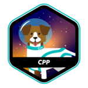

# Hi, I'm Princy 👋

**FullStack Developer** · Madagascar 🇲🇬 · 42 School Antananarivo

---

## 🧑🏻‍💻 About Me

- 💻 Passionate about **artificial intelligence**
- 🎓 Graduated with a **degree in application development**
- 📚 Currently studying at **42 School Antananarivo**, discovering new skills every day
- 🌱 Always exploring new technologies, learning continuously, and sharing knowledge

---

## 📬 Connect With Me

  
  &nbsp;&nbsp;
  
  &nbsp;&nbsp;
  

---

## 🎯 Skills

<table>
  <tr>
    <th>Programming Languages</th>
    <th>Frontend</th>
    <th>Backend & Runtime</th>
  </tr>
  <tr>
    <td>
      
      
      
      
      
      
      
    </td>
    <td>
      
      
      
      
      
    </td>
    <td>
      
      
      
      
      
      
      
    </td>
  </tr>
  <tr>
    <th>Database & ORM</th>
    <th>DevOps & Tools</th>
    <th>Mobile & Game</th>
  </tr>
  <tr>
    <td>
      
      
      
      
      
    </td>
    <td>
      
      
    </td>
    <td>
      
      
      
    </td>
  </tr>
</table>

---

## ✅ 42 Common Core Projects

|                |
| :--- |

---
